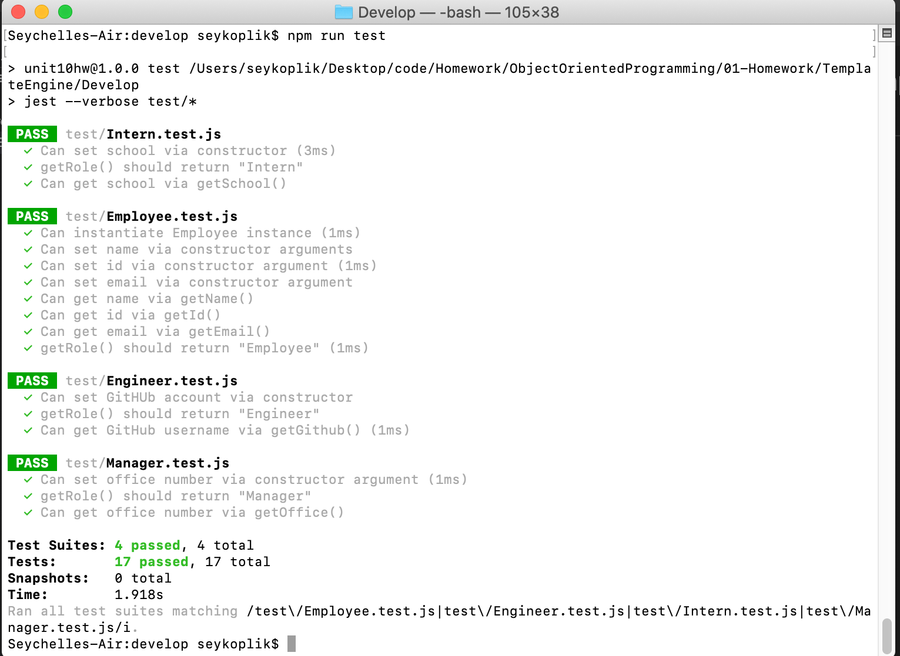
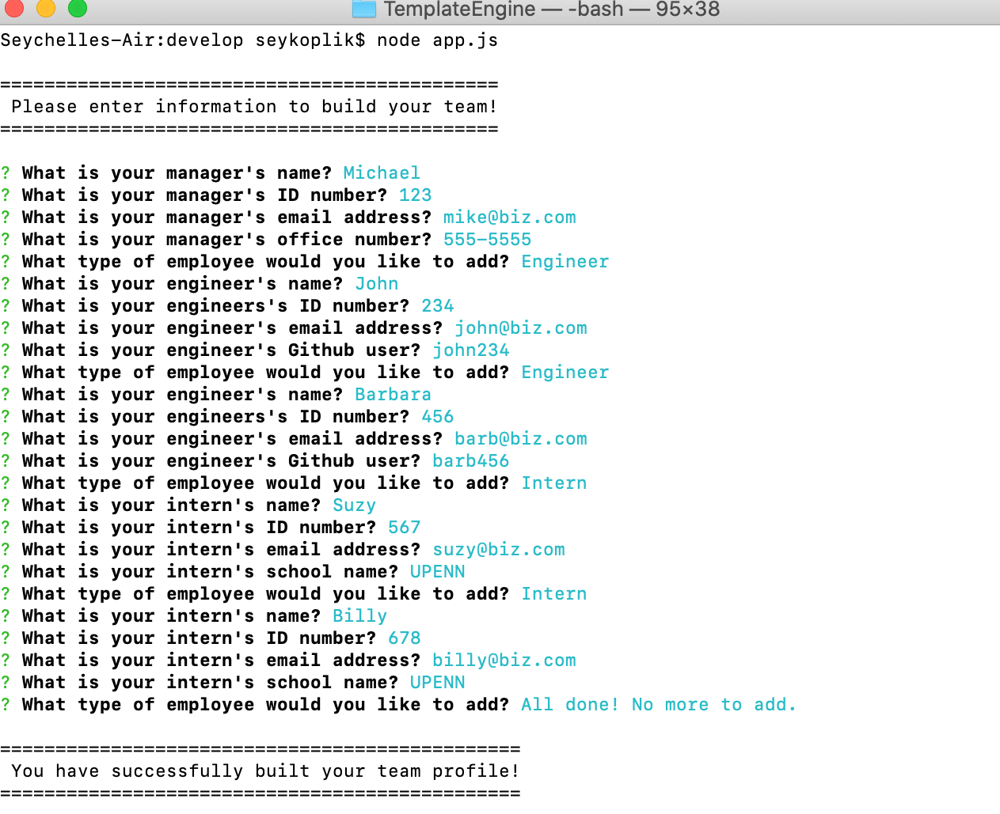
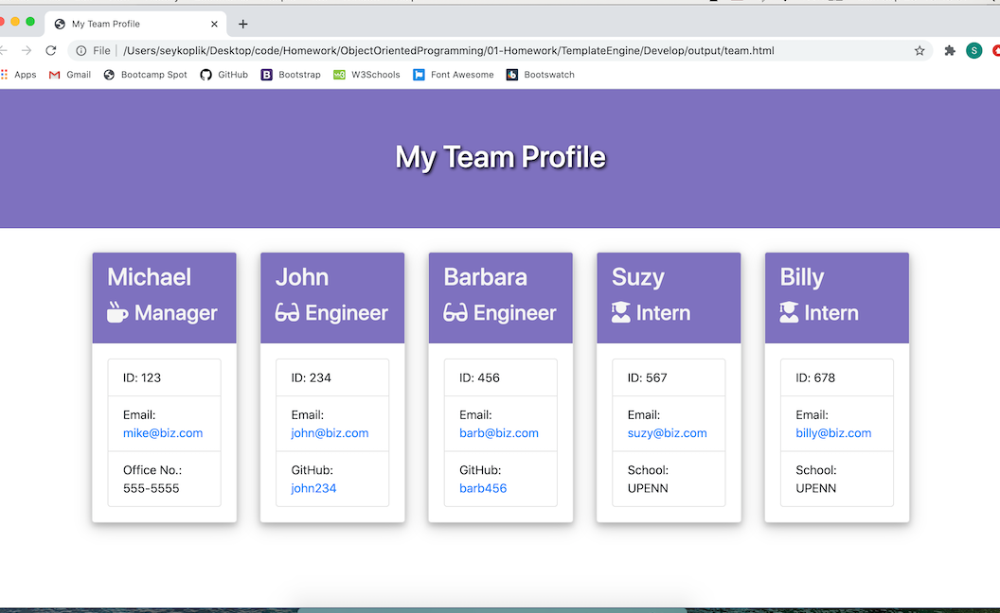

# Template Engine - Employee Profile Generator

## Description

A Node CLI that takes in an information about employees and generates an HTML webpage that displays information about a particular employee based on their role withint the company. 

Also, running jest to determine if built testing parameters are met about particular areas of the employee profile maker is deemed successful. Determining each class for a particular type of employee and inheriting from the general employee data that the prompt will be required to ask about each particular employee.

In the CLI, user will be asked certain questions that need an input about employee whether they are a Manager, Engineer, or Intern position and each input is validated to be true based on conditions met. 


## Screenshots


<br>

<br>


## Installation
```
$ npm install jest
 -- $ npm run test
```
```
$ npm install inquirer
 -- $ node app.js 
```
## Usage

* User can run test and pass all tests
* User can go into command line and go to node app.js and be asked a variety of question to input information about employees
* User enter input into the prompt and get a validation whether input typed in is accepted or not
* User has a choice of what type of employee to add and can be presented with a series of question of what to log for that particular type of employee
* User can exit the prompt and a team.html file is generated to view the team that was created


## Attributes
<a href="https://www.npmjs.com/package/inquirer"> Inquire.js</a>
<br>
<a href="https://jestjs.io/">Jestjs</a>


## License
[](https://opensource.org/licenses/MIT)


## Links

<ul>
<li><a href="https://github.com/SeyKoplik/TemplateEngine">Repository<a></li>
<li><a href="./Develop/output/team.html">team.html</a></li>
<li><a href="https://drive.google.com/file/d/1YeqKTOBJfSeS6SL-A7onDaT6RrBz4F61/view">CLI run thru video</a></li>
</ul>